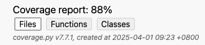

# Simple Banking System

A Python-based banking system for managing accounts and transactions with 88% test coverage. This project demonstrates enterprise-ready design patterns including transaction atomicity, thread-safe concurrency control, storage abstraction (CSV/SQLite), and comprehensive logging. Built with clean architecture principles and extensive edge test cases for all critical functionality.



## Table of Contents
- [System Summary](#system-summary)
- [Features](#features)
  - [Basic Features](#basic-features)
  - [Advanced Features](#advanced-features)
- [Project Structure](#project-structure)
- [Documentation](#documentation)
- [Usage](#usage)
  - [Prerequisites](#prerequisites)
  - [Installation](#installation)
  - [Running the Application](#running-the-application)
  - [Using Docker](#using-docker)
  - [Command-Line Options](#command-line-options)
  - [Interactive Menu](#interactive-menu)
- [Testing](#testing)
  - [Running Tests](#running-tests)
  - [Test Structure](#test-structure)
- [How to Run Code Coverage](#how-to-run-code-coverage)
- [Future Work](#future-work)

## System Summary

This banking system is designed to be simple, robust, and secure, supporting key functionalities such as account creation, balance checks, deposits, withdrawals, transfers, and transaction history.

At the heart of the system is the principle of **transaction atomicity**. The `TransactionManager` class ensures that operations involving money are executed atomically through the following mechanisms:

* A context manager (`atomic_transaction`) acquires locks on all involved accounts in a sorted order to avoid deadlocks
* Account balances are backed up before any changes are made
* If an exception occurs during the transaction, the system rolls back to the previous state

The system supports **concurrent operations** through the `TransactionManager` which:
* Uses thread locks (`threading.RLock`) to protect account access
* Ensures no two operations can modify the same account simultaneously
* Acquires locks in a consistent order to prevent deadlocks

**Transaction logging** is implemented through the `TransactionLogger` class, which:
* Records all banking operations (deposits, withdrawals, transfers)
* Timestamps each transaction
* Stores success/failure status and reason codes
* Provides methods to retrieve transaction history by account or action type

The system includes **input validation** for all operations:
* Account names cannot be empty
* Initial balances cannot be negative
* Deposit and withdrawal amounts must be positive
* Withdrawals cannot exceed available balance

**Storage flexibility** is provided through:
* An `IStorage` interface that abstracts storage operations
* `CSVStorage` implementation for simple file-based storage
* `SQLiteStorage` implementation for database storage
* A `StorageFactory` to create the appropriate storage implementation

**Account ID formatting** ensures consistency:
* All account IDs follow the format ACC0001 (ACC followed by a 4-digit number)
* The system properly handles both new and existing account IDs
* The `_determine_next_account_id` method ensures unique IDs are assigned

**Error handling** is robust throughout the system:
* Transactions are rolled back on failure
* Detailed error messages are provided
* Failed operations are logged with reason codes

## Features

### Basic Features
1. Create bank accounts with a name and starting balance
2. Deposit money to accounts
3. Withdraw money from accounts
4. Prevent overdrafting accounts
5. Transfer money between accounts in the same banking system
6. Save and load system state to CSV

### Advanced Features
- **[Transaction Management](docs/transaction_atomicity.md)**: Ensures atomicity and thread safety
- **[Transaction Logging](docs/logging_scalability.md)**: Logs all banking operations
- **[Database Storage](docs/database_storage.md)**: Optional SQLite storage (`-DStorage sqlite`)

## Project Structure

The project follows a modular architecture organized by functional domains:

```
SimpleBanking/
├── .venv/                           # Virtual environment (Python 3.9)
├── advanced_features/               # Enhanced functionality modules
│   ├── __init__.py
│   ├── logging/                     # Transaction logging system
│   │   ├── __init__.py
│   │   ├── architecture/            # Scalable logging architecture
│   │   │   ├── __init__.py
│   │   │   ├── enterprise_placeholders.py  # Interface definitions for enterprise integrations
│   │   │   ├── facade.py            # Simplified interface to logging system
│   │   │   ├── interfaces.py        # Logging component interfaces
│   │   │   └── simple_implementation.py # Basic implementation of interfaces
│   │   └── transaction_logger.py    # Transaction logging implementation
│   │
│   ├── security/                    # Security-related features
│   │   ├── __init__.py              # Security module placeholder
│   │   └── users.json               # User data storage
│   │
│   ├── storage/                     # Advanced storage options
│   │   ├── __init__.py
│   │   ├── database/                # Database storage implementations
│   │   │   ├── __init__.py
│   │   │   ├── database_manager.py  # SQLite database manager
│   │   │   └── sqlite_storage.py    # SQLite storage implementation
│   │   └── storage_factory.py       # Factory for creating storage instances
│   │
│   └── transaction_management/      # Transaction atomicity implementation
│       ├── __init__.py
│       └── transaction_manager.py   # Ensures atomic operations
│
├── basic_required_features/         # Core banking functionality
│   ├── __init__.py
│   ├── account.py                   # Bank account class definition
│   ├── banking_system.py            # Main banking system implementation
│   ├── csv_storage.py               # CSV-based storage implementation
│   └── i_storage.py                 # Storage interface definition
│
├── data/                            # Data storage directory
│   ├── accounts.csv                 # CSV storage for account data
│   ├── banking.db                   # SQLite database (when using SQLite)
│   └── banking_data.csv             # Alternative CSV storage format
│
├── docs/                            # Detailed documentation
│   ├── transaction_atomicity.md     # Documentation on transaction atomicity
│   ├── logging_scalability.md       # Documentation on logging architecture
│   └── database_storage.md          # Documentation on storage options
│
├── facade/                          # Simplified interface layer
│   ├── __init__.py
│   └── banking.py                   # Facade for banking operations
│
├── htmlcov/                         # HTML coverage report directory
│   └── index.html                   # Main coverage report page
│
├── logs/                            # Transaction log files
│   └── transactions.log             # Log file for banking transactions
│
├── myenv/                           # Alternative virtual environment
│
├── sqlite_examples/                 # SQLite usage examples
│   ├── sqlite_query_demo.py         # Demo for SQLite queries
│   └── sqlite_storage_demo.py       # Demo for SQLite storage
│
├── tests/                           # Comprehensive test suite
│   ├── __init__.py
│   ├── basic_required_features/     # Tests for core functionality
│   │   ├── __init__.py
│   │   ├── test_basic_required_features.py # Tests for core features
│   │   └── test_data_quality.py     # Data validation tests
│   └── advanced_features/           # Tests for enhanced features
│       ├── __init__.py
│       ├── test_advanced_features.py # General advanced feature tests
│       ├── test_logging_architecture.py # Tests for logging architecture
│       ├── test_sqlite_storage.py   # Tests for SQLite storage
│       ├── test_transaction_logging.py # Tests for transaction logging
│       └── test_transaction_management.py # Tests for atomicity
│
├── venv/                            # Another virtual environment
│
├── .coverage                        # Coverage data file
├── __init__.py                      # Package initialization
├── Dockerfile                       # Docker configuration
├── img.png                          # Project image
├── main.py                          # Application entry point
├── README.md                        # Project documentation
├── requirements.txt                 # Project dependencies
├── setup_mac.sh                     # Setup script for macOS
├── setup_window.bat                 # Setup script for Windows
└── SimpleBanking.iml                # IntelliJ IDEA module file
```

### Key Package Responsibilities

- **advanced_features**: Houses all enhanced functionality beyond the basic requirements:
  - **logging**: Implements a scalable transaction logging system with a pluggable architecture
  - **security**: Contains placeholder for security features (to be implemented in future sprints)
  - **storage**: Offers database storage options with SQLite implementation
  - **transaction_management**: Ensures atomic operations through proper locking mechanisms

- **basic_required_features**: Contains the core banking functionality including account management, deposits, withdrawals, and transfers. The `banking_system.py` file is the central component that orchestrates all basic operations.

- **data**: Storage directory for database files and other persistent data.

- **docs**: Houses detailed documentation on key architectural components and design decisions.

- **facade**: Provides a simplified interface to the banking system, abstracting away the complexity of the underlying implementation.

- **htmlcov**: Contains the HTML coverage reports generated by the coverage tool.

- **logs**: Directory for transaction log files and system logs.

- **sqlite_examples**: Contains example scripts demonstrating SQLite usage and queries.

- **tests**: Contains a comprehensive test suite with over 88% code coverage, organized to mirror the project structure.

### Key Design Patterns Used

- **Facade Pattern**: Simplifies the complex banking system interface
- **Factory Pattern**: Creates appropriate storage implementations based on configuration
- **Strategy Pattern**: Allows different storage strategies to be used interchangeably
- **Adapter Pattern**: Adapts the logging system to work with different consumers
- **Context Manager Pattern**: Implements atomic transactions with proper resource management

## Documentation

The `docs/` directory contains detailed documentation on various aspects of the system:

- **[Transaction Atomicity](docs/transaction_atomicity.md)**: How the system ensures operations complete fully or not at all
- **[Logging Scalability](docs/logging_scalability.md)**: How the logging system scales for big data applications
- **[Database Storage](docs/database_storage.md)**: Details on the SQLite storage implementation

## Usage

### Prerequisites
- Python 3.6 or higher
- No external dependencies required for basic functionality
- SQLite3 (included in Python standard library) for database storage

### Installation
1. Clone the repository:
   ```
   git clone https://github.com/yourusername/SimpleBanking.git
   cd SimpleBanking
   ```

2. No additional installation steps required - the system uses only Python standard libraries.

### Running the Application

#### Basic Usage with CSV Storage (Default)
```
python main.py
```

#### Using SQLite Storage
```
python main.py -DStorage sqlite -DStoragePath data/banking.db
```

#### Using Setup Scripts
For convenience, you can also use the provided setup scripts to run the application:

**On macOS/Linux:**
```
./setup_mac.sh
```

**On Windows:**
```
setup_window.bat
```

These scripts set up the environment and launch the application with default settings. They're particularly useful for first-time users or when demonstrating the system.

### Using Docker

#### Prerequisites
- Docker installed on your system ([Get Docker](https://docs.docker.com/get-docker/))

#### Building the Docker Image
1. Navigate to the SimpleBanking directory (where the Dockerfile is located):
   ```
   cd /path/to/SimpleBanking
   ```

2. Build the Docker image:
   ```
   docker build -t simple-banking .
   ```

#### Running with Docker
All commands below should be run from the SimpleBanking directory:

1. Run with default CSV storage (Data will be lost when container is removed):
   ```
   docker run -it --name banking-app simple-banking
   ```

2. Run with SQLite storage (Data will be lost when container is removed):
   ```
   docker run -it --name banking-app simple-banking -DStorage sqlite
   ```

3. Run with persistent data storage (✅ RECOMMENDED):
   ```
   docker run -it -v $(pwd)/data:/app/data --name banking-app simple-banking
   ```

4. Run with both persistent data and specific storage type (RECOMMENDED):
   ```
   docker run -it -v $(pwd)/data:/app/data --name banking-app simple-banking -DStorage sqlite -DStoragePath data/banking.db
   ```

#### Important: Saving Your Data

When using Docker, follow these steps to ensure your data is saved:

1. **Always use volume mounting** (`-v $(pwd)/data:/app/data`) to persist your data
2. **Save system state before exiting** by selecting option 6 (Save system state) or option 9 (Exit) from the menu
3. **Use the same container name** when restarting to maintain your container state:
   ```
   docker start -i banking-app
   ```

If you don't follow these steps, your account data will be lost when the container stops!

#### Managing Docker Containers

1. Stop the container:
   ```
   docker stop banking-app
   ```

2. Restart an existing container (preserves container state):
   ```
   docker start -i banking-app
   ```

3. Remove the container (This will delete container state):
   ```
   docker rm banking-app
   ```

### Command-Line Options
- `-DStorage`: Storage type to use (`csv` or `sqlite`). Default is `csv`.
- `-DStoragePath`: Path to the storage file. If not provided, defaults to:
  - `data/banking_data.csv` for CSV storage
  - `data/banking.db` for SQLite storage

### Interactive Menu
Once running, the application presents an interactive menu:
1. Create a new account
2. Deposit money
3. Withdraw money
4. Transfer money
5. View account details
6. Save system state
7. Load system state
8. View transaction logs
9. Exit

Enter the number corresponding to the desired action and follow the prompts.

## Testing

The SimpleBanking system includes a comprehensive test suite to ensure all functionality works correctly.

### Prerequisites
- Python 3.6 or higher
- pytest (included in requirements.txt)

### Installing Test Dependencies
```
pip install -r requirements.txt
```

### Running Tests

#### Run All Tests
```
python -m pytest
```

#### Run Tests with Verbose Output
```
python -m pytest -v
```

#### Run Specific Test Modules
```
# Run basic features tests
python -m pytest tests/basic_required_features/

# Run advanced features tests
python -m pytest tests/advanced_features/
```

#### Run Specific Test Cases
```
# Run data quality tests
python -m pytest tests/basic_required_features/test_data_quality.py

# Run specific test method
python -m pytest tests/basic_required_features/test_data_quality.py::TestDataQuality::test_data_validation
```

#### Run Tests with Coverage Report
```
python -m pytest --cov=basic_required_features --cov=advanced_features
```

### Test Structure
- `tests/basic_required_features/`: Tests for core banking functionality
- `tests/advanced_features/`: Tests for enhanced features like transaction management and storage

## How to Run Code Coverage

### Installing Coverage

If you're using PyCharm Professional Edition, code coverage is built-in. For PyCharm Community Edition or other editors, install the coverage package:

```
# Create and activate a virtual environment (recommended)
python3 -m venv myenv
source myenv/bin/activate  # On Windows: myenv\Scripts\activate

# Install coverage
pip install coverage pytest

# Verify installation
coverage --version
```

### Running Tests with Coverage

Run all tests with coverage tracking:

```
# From the project root directory
coverage run -m pytest tests/
```

For specific test modules or classes:

```
# Run coverage on specific test modules
coverage run -m pytest tests/basic_required_features/
coverage run -m pytest tests/advanced_features/test_transaction_management.py
```

### Generating Coverage Reports

Generate a terminal report with line numbers of missed statements:

```
coverage report -m
```

Generate an HTML report for better visualization:

```
coverage html
```

### Viewing the Coverage Report

The HTML report is generated in the `htmlcov` directory. Open `htmlcov/index.html` in your web browser to view the interactive report.

```bash
# On macOS
open htmlcov/index.html
```
```bash
# On Linux
xdg-open htmlcov/index.html
```
```bash
# On Windows
start htmlcov/index.html
```

The report shows:
- Overall code coverage percentage (currently 88%)
- File-by-file breakdown of coverage
- Line-by-line highlighting of covered and missed code
- Branch coverage statistics

You can click on any file to see detailed line coverage with color coding:
- Green: Covered lines
- Red: Uncovered lines
- Yellow: Partially covered branches

## Future Work

1. Scalable Architecture

* Microservices & Modularization:
  Break down the monolithic system into smaller services (e.g., account management,
  transactions, audit logging) that can be developed, deployed, and scaled independently.
* Load Balancing:
  Use load balancers to distribute incoming requests across multiple servers. This helps
  manage high traffic and avoids overloading a single instance.

2. Database Enhancements

* Robust, Scalable Databases:
  Migrate from an in-memory or single-instance database to robust relational (e.g.,
  PostgreSQL, MySQL) or NoSQL solution that supports sharding, replication, and
  clustering.
* Connection Pooling & Caching:
  Manage database connections efficiently and implement
  caching (with tools like Redis or Memcached) for frequently accessed data.

3. Concurrency and Transaction Management

* Distributed Transactions:
  For multi-step operations across services or databases, consider distributed transaction
  management (or design your system to handle eventual consistency where
  appropriate).
* Optimistic Concurrency Control:
  Instead of relying solely on locks, you might use techniques like versioning to manage
  concurrent updates without significant performance penalties.

4. Asynchronous Processing and Queuing

* Background Jobs:
  Offload non-critical or time-consuming tasks (such as sending notifications or generating
  reports) to background workers using message queues (e.g., RabbitMQ, Kafka).
* Event-Driven Architecture:
  Implement event-driven systems where different parts of your application communicate
  via events. This decouples services and enhances responsiveness.

5. API Management and Rate Limiting

* API Gateway:
  Use an API gateway to handle authentication, rate limiting, and routing of requests. This
  ensures that no single client or set of requests can overwhelm your services.
* Rate Limiting:
  Implement rate limiting to prevent abuse and ensure fair usage across all users.

6. Enhanced Security and Monitoring

* Stronger Authentication & Authorization:
  Adopt robust mechanisms such as multi-factor authentication (MFA) and role-based
  access control (RBAC). Secure your API endpoints and data transfers.
* Comprehensive Logging and Monitoring:
  Use centralized logging, real-time monitoring, and alerting tools to quickly detect,
  diagnose, and respond to issues. Consider tools like ELK Stack, Prometheus, or Grafana.

7. Containerization and Orchestration

* Docker & Kubernetes:
  Containerize your services using Docker and manage them with orchestration tools like
  Kubernetes. This allows you to scale your services dynamically based on demand.

8. Testing and Continuous Integration

* Automated Testing:
  Implement extensive automated tests (unit, integration, performance, and stress tests)
  to ensure the system can handle heavy loads without errors.
* CI/CD Pipelines:
  Use continuous integration and deployment pipelines to streamline updates, rollbacks,
  and maintain high availability.

9. Additional Banking Features

* Account-Level Transaction History:
  Implement per-account transaction history tracking where each account maintains its own
  complete history of operations with timestamps, amounts, and notes.
* Asynchronous Notification System:
  Add a background worker thread and job queue system to handle non-critical tasks like
  user notifications asynchronously without blocking main operations.
* Enhanced Security with Password Hashing:
  Implement secure password hashing using SHA-256 or more advanced algorithms (PBKDF2, bcrypt)
  integrated directly with the core account management system.
* Account Authentication for Operations:
  Add authentication requirements for sensitive operations like withdrawals and transfers
  to verify the user's identity before proceeding.
* Comprehensive Account Lifecycle Management:
  Implement full account lifecycle features including account suspension, reactivation,
  and closure with proper state management.
* Advanced Error Recovery:
  Enhance the system with more sophisticated error recovery mechanisms for handling
  partial failures in distributed environments.
